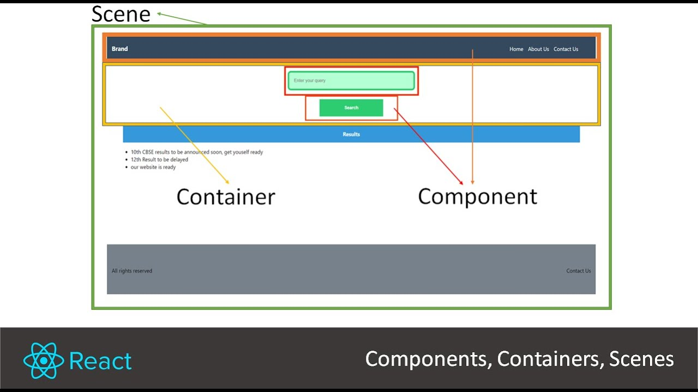

# 🎨 React의 Container와 Component
리액트의 **Container**와 **Component**는 역할에 따라 구분되는 컴포넌트 패턴입니다.     
이들은 관심사의 분리(Separation of Concerns)를 통해 코드의 가독성과 유지보수성을 높이는 데 도움을 줍니다.

## 1. Container와 Component의 차이점
#### 1. **Component (프레젠테이션 컴포넌트)**
- **역할**: UI를 그리는 데 집중하며, **화면에 보여지는 요소**를 정의합니다.
- **특징**:
  - 데이터 로직을 처리하지 않고, 필요한 데이터를 부모 컴포넌트로부터 `props`로 전달받아 사용합니다.
  - 대부분 DOM 마크업과 스타일을 포함하며, 애플리케이션의 나머지 부분에 의존하지 않습니다.
  - 재사용 가능한 UI 요소(예: 버튼, 입력창, 카드 등)를 만드는 데 사용됩니다.
- **예제**:
  ```jsx
  import React from 'react';

  const Button = ({ label, onClick }) => (
    {label}
  );

  export default Button;
  ```

#### 2. **Container (컨테이너 컴포넌트)**
- **역할**: 데이터 처리 및 상태 관리를 담당하며, **비즈니스 로직**을 구현합니다.
- **특징**:
  - 리덕스 또는 API와 연결되어 데이터를 가져오고, 이를 컴포넌트에 전달합니다.
  - 상태 관리 및 이벤트 처리를 수행하며, 컴포넌트의 동작을 제어합니다.
  - 일반적으로 UI를 직접 렌더링하지 않고, 다른 컴포넌트(프레젠테이션 컴포넌트)를 포함하여 데이터를 전달하는 역할을 합니다.
- **예제**:
  ```jsx
  import React, { useState } from 'react';
  import Button from './Button';

  const ButtonContainer = () => {
    const [count, setCount] = useState(0);

    const handleClick = () => {
      setCount(count + 1);
    };

    return ;
  };

  export default ButtonContainer;
  ```

---

### **핵심 차이점 비교**

| **구분**         | **Component**                           | **Container**                           |
|-------------------|-----------------------------------------|-----------------------------------------|
| **주요 역할**     | UI 렌더링                               | 데이터 처리 및 상태 관리                |
| **데이터 관리**   | `props`로 전달받은 데이터만 사용        | 상태 관리 및 API 호출 등을 통해 데이터 처리 |
| **재사용성**     | 높음                                    | 상대적으로 낮음                         |
| **의존성**       | 독립적 (외부 데이터와 로직에 의존하지 않음) | 외부 데이터와 로직에 밀접하게 연결      |
| **예시 작업**     | 버튼, 폼 등 화면 요소                  | 이벤트 처리, 리덕스 상태 관리           |

---

### **장점**
1. **관심사 분리**:
   - UI와 데이터 로직을 분리하여 코드의 가독성과 유지보수성을 높입니다.
2. **재사용성 향상**:
   - 동일한 프레젠테이션 컴포넌트를 여러 컨테이너에서 재사용할 수 있습니다.
3. **성능 최적화**:
   - 컨테이너가 업데이트되더라도 프레젠테이션 컴포넌트에 영향을 주지 않아 불필요한 렌더링을 방지할 수 있습니다.

---

## 2. 🔲 Container 살펴보기기
```jsx
import React from 'react';

export const Container = ({ children }) => {
  return (
    <div className="container">
      {children}
    </div>
  );
};
```
### `Container`란?    
<caption>이미지 출처: https://www.youtube.com/watch?v=zd5BMWt0FpE</caption>

`Container`는 React 컴포넌트 중 가장 기본이 되는 컴포넌트로, **하위 컴포넌트(children)**를 감싸는 역할을 합니다. 이 컴포넌트는 다음과 같은 특징을 가지고 있습니다:   

---

#### **1. 역할**
- `Container`는 부모 컴포넌트로서, 자식 요소(`children`)를 포함하여 레이아웃을 구성합니다.
- `className` 속성을을 통해 스타일을 적용할 수 있는 구조를 제공합니다.

---

#### **2. 사용 목적**
- **재사용성**: 동일한 레이아웃 스타일을 여러 곳에서 반복적으로 사용할 수 있도록 설계되었습니다.
- **유연성**: `children`을 통해 어떤 요소든 자유롭게 삽입 가능하며, 이를 통해 다양한 UI를 구성할 수 있습니다.

---

#### **3. 주요 코드 설명**
```jsx
export const Container = ({ children }) => {
  return (
    
      {children}
    
  );
};
```
---
- `({ children })`: React 컴포넌트의 props 중 하나인 `children`을 받아옵니다. 이는 부모 컴포넌트에서 전달된 하위 요소를 나타냅니다.
- ``: HTML의 `` 태그에 `container`라는 클래스명을 부여하여 스타일을 지정할 수 있습니다.
- `{children}`: 부모 컴포넌트에서 전달된 자식 요소가 렌더링됩니다.
---

#### **4. 확장 가능성**
- CSS 파일에서 `.container` 클래스에 스타일을 정의하여 디자인을 커스터마이징할 수 있습니다.
- 추가적인 props를 받아 다양한 기능(예: `id`, `style`)을 구현할 수도 있습니다:
```jsx
export const Container = ({ children, style }) => {
  return (
    
      {children}
    
  );
};
```
---
#### **5. 사용 예시**
```jsx
// 03-프로젝트\00_hello_react\src\components\Day01_01_Greeting.jsx
// Greeting과 AgeCheck 컴포넌트 만들기
import React from 'react';

export const Greeting = ({ name, age }) => {
    return (
      <p>
        안녕하세요! 제 이름은 {name}이고, 나이는 {age}살입니다.
      </p>
    );
  };


export const AgeCheck = ({ age }) => {
    return (
        <p>{age}세는 {age >= 20 ? "성인":"미성년자"}입니다.</p>
    );
}
```


```jsx
// 03-프로젝트\00_hello_react\src\Day01_01_App.js
import React from 'react';
import { Greeting, AgeCheck } from './components/Day01_01_Greeting';


export default function App({name, age}) {
    return (
        <div className="App">
            <Greeting name="홍길동" age="20"/>
            <AgeCheck age="10+1"/>
            <AgeCheck age="20+1"/>
            <AgeCheck age={10+1}/>
            <AgeCheck age={20+1}/>
            <Greeting name={name} age={age}/>
            <AgeCheck age={age}/>
        </div>
    );
}
```

```jsx
// 03-프로젝트\00_hello_react\src\index.js
import React from 'react';
import ReactDOM from 'react-dom/client';
import './index.css';
import reportWebVitals from './reportWebVitals';

import App from './Day01_01_App';

const root = ReactDOM.createRoot(document.getElementById('root'));
root.render(
  <React.StrictMode>
    <App name="고길동" age="40" />  {/*이 부분 수정*/} 
  </React.StrictMode>
);

// If you want to start measuring performance in your app, pass a function
// to log results (for example: reportWebVitals(console.log))
// or send to an analytics endpoint. Learn more: https://bit.ly/CRA-vitals
reportWebVitals();

```

---

### 결론
`Container`는 React의 컴포넌트 설계 패턴 중 하나로, **레이아웃 구성의 일관성을 유지**하고, **재사용 가능한 UI 구조**를 제공하는 데 매우 유용합니다.
