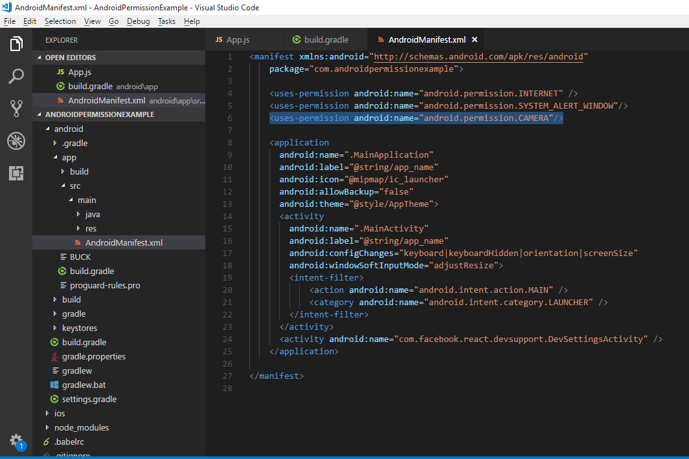

# React Native 디바이스 기능 접근 및 퍼미션 처리
React Native에서 카메라, 마이크, 위치 정보, NFC 등 디바이스 기능을 접근하고, 퍼미션(permission)을 처리하는 방법을 학습합니다. 이를 통해 사용자 데이터 보호와 앱 기능의 원활한 구현을 실현합니다.

---

## 1. React Native에서 디바이스 기능 접근 방식

### **카메라 접근**
React Native에서 카메라를 사용하려면 `react-native-vision-camera` 또는 `react-native-camera`와 같은 라이브러리를 사용할 수 있습니다.

#### 설치 및 설정:
```bash
npm install react-native-vision-camera
```

#### iOS 설정: (XCode 빌드)
`Info.plist`에 아래 내용을 추가:
```xml
<key>NSCameraUsageDescription</key>
<string>앱이 카메라를 사용해야 합니다.</string>
<key>NSMicrophoneUsageDescription</key>
<string>앱이 마이크를 사용해야 합니다.</string>
```

#### Android 설정: (Android Studio 빌드)
`AndroidManifest.xml`에 아래 내용을 추가:
```xml
<uses-permission android:name="android.permission.CAMERA" />
<uses-permission android:name="android.permission.RECORD_AUDIO" />
```

#### Expo 설정(app.json)
Expo 프레임워크는 위 독립적인 플랫폼 권한 관리를 한꺼번에 설정할 수 있습니다.
```json
{
  "expo": {
    "name": "YourAppName",
    "slug": "your-app-slug",  // Expo 프로젝트의 고유한 식별자.  앱의 URL 경로나 배포 시 사용되는 "짧은 이름"
    "plugins": [
      [
        "expo-camera",
        {
          "cameraPermission": "앱이 카메라를 사용해야 합니다.",
          "microphonePermission": "앱이 마이크를 사용해야 합니다."
        }
      ]
    ],
    "android": {
      "permissions": [
        "CAMERA",
        "RECORD_AUDIO"
      ]
    }
  }
}

```

#### 카메라 퍼미션 요청 및 사용 예제:

##### 추가 expo 라이브러리 설치
```bash
npx expo install @expo/config expo-camera
npm install react-native-vision-camera
```

### Component 추가
```jsx
import React, { useState, useRef, useEffect } from 'react';
import { Button, StyleSheet, Text, TouchableOpacity, View, Image, Platform } from 'react-native';
import { CameraView, Camera } from 'expo-camera';

export default function App() {
  const [hasPermission, setHasPermission] = useState(null);
  const [type, setType] = useState(Platform.OS === 'web' ? 'user' : 'back');
  const [photo, setPhoto] = useState(null);
  const cameraRef = useRef(null);

  // 권한 처리 함수
  const requestPermissions = async () => {
    if (Platform.OS === 'web') {
      try {
        const stream = await navigator.mediaDevices.getUserMedia({ video: true });
        stream.getTracks().forEach(track => track.stop());
        setHasPermission(true);
      } catch (err) {
        console.error('Web camera error:', err);
        setHasPermission(false);
      }
    } else {
      const { status } = await Camera.requestCameraPermissionsAsync();
      setHasPermission(status === 'granted');
    }
  };

  useEffect(() => {
    requestPermissions();
  }, []);

  const takePicture = async () => {
    if (!cameraRef.current) return;
    
    try {
      const data = await cameraRef.current.takePictureAsync();
      setPhoto(data.uri);
    } catch (error) {
      console.error('촬영 오류:', error);
    }
  };

  const toggleCameraType = () => {
    console.log('카메라 전환   :', type);
    setType(prev => {
      if (Platform.OS === 'web') {
        return prev === 'user' ? 'environment' : 'user';
      }
      return prev === 'back' ? 'front' : 'back';
    });
  };

  const renderCamera = () => {
    if (Platform.OS === 'web') {
      return (
        <video
          ref={cameraRef}
          style={styles.camera}
          autoPlay
          playsInline
          muted
        >
          <track kind="captions" />
        </video>
      );
    }

    return (
      <CameraView 
        style={styles.camera} 
        facing={type}
        ref={cameraRef}
        useCamera2Api={false}
      >
        <View style={styles.controls}>
          <TouchableOpacity
            style={styles.controlButton}
            onPress={toggleCameraType}
          >
            <Text style={styles.buttonText}>전환</Text>
          </TouchableOpacity>
          <TouchableOpacity
            style={[styles.controlButton, styles.captureButton]}
            onPress={takePicture}
          >
            <Text style={styles.buttonText}>촬영</Text>
          </TouchableOpacity>
        </View>
      </CameraView>
    );
  };

  // 권한 상태에 따른 UI 처리
  if (hasPermission === null) {
    return (
      <View style={styles.container}>
        <Text>카메라 접근 권한 확인 중...</Text>
      </View>
    );
  }

  if (hasPermission === false) {
    return (
      <View style={styles.container}>
        <Text style={styles.permissionText}>
          카메라 접근이 거부되었습니다.{'\n'}
          {Platform.OS === 'web' 
            ? '브라우저 설정에서 권한을 허용해주세요.' 
            : '기기 설정에서 권한을 활성화해주세요.'}
        </Text>
        <Button title="권한 다시 요청" onPress={requestPermissions} />
      </View>
    );
  }

  return (
    <View style={styles.container}>
      {photo ? (
        <View style={styles.previewContainer}>
          <Image source={{ uri: photo }} style={styles.previewImage} />
          <Button title="다시 찍기" onPress={() => setPhoto(null)} />
        </View>
      ) : renderCamera()}
    </View>
  );
}

const styles = StyleSheet.create({
  container: {
    flex: 1,
    justifyContent: 'center',
    alignItems: 'center',
    backgroundColor: '#f0f0f0',
  },
  camera: {
    flex: 1,
    width: '100%',
  },
  previewContainer: {
    flex: 1,
    width: '100%',
  },
  previewImage: {
    flex: 1,
    resizeMode: 'contain',
  },
  controls: {
    position: 'absolute',
    bottom: 30,
    left: 20,
    right: 20,
    flexDirection: 'row',
    justifyContent: 'space-between',
    alignItems: 'center',
  },
  controlButton: {
    backgroundColor: 'rgba(0,0,0,0.5)',
    padding: 15,
    borderRadius: 10,
    minWidth: 100,
    alignItems: 'center',
  },
  captureButton: {
    backgroundColor: 'rgba(255,255,255,0.3)',
  },
  buttonText: {
    color: 'white',
    fontSize: 18,
    fontWeight: 'bold',
  },
  permissionText: {
    fontSize: 18,
    textAlign: 'center',
    marginBottom: 20,
    lineHeight: 28,
  },
});
```

---

### **마이크 접근**
마이크는 카메라와 동일한 방식으로 설정하며, `react-native-vision-camera`에서 마이크 퍼미션도 처리할 수 있습니다.

---

### **위치 정보 접근**

#### 설치:
```bash
npm install react-native-permissions 
npx expo install expo-location
```

#### 위치 정보 확인 기본 예제:
```jsx
import React, { useState, useEffect } from 'react';
import { StyleSheet, Text, View, Button, Platform, ActivityIndicator } from 'react-native';
import * as Location from 'expo-location';

export default function App() {
  const [hasLocationPermission, setHasPermission] = useState(null);
  const [location, setLocation] = useState(null);
  const [error, setError] = useState('');

  // 권한 요청 및 위치 조회 함수
  const getLocation = async () => {
    try {
      // 권한 요청
      let { status } = await Location.requestForegroundPermissionsAsync();
      
      if (status !== 'granted') {
        setError('위치 접근 권한이 필요합니다');
        setHasPermission(false);
        return;
      }

      setHasPermission(true);
      
      // 위치 정보 가져오기
      const locationData = await Location.getCurrentPositionAsync({
        accuracy: Location.Accuracy.BestForNavigation,
      });
      setLocation(locationData);
    } catch (err) {
      setError(err.message);
    }
  };

  useEffect(() => {
    getLocation();
  }, []);

  // 권한 상태에 따른 UI 처리
  if (hasLocationPermission === null) {
    return (
      <View style={styles.container}>
        <ActivityIndicator size="large" />
        <Text>위치 권한 확인 중...</Text>
      </View>
    );
  }

  if (hasLocationPermission === false) {
    return (
      <View style={styles.container}>
        <Text style={styles.errorText}>{error}</Text>
        <Button title="권한 다시 요청" onPress={getLocation} />
      </View>
    );
  }

  return (
    <View style={styles.container}>
      {location ? (
        <>
          <Text style={styles.title}>현재 위치 정보</Text>
          <View style={styles.infoBox}>
            <Text>위도: {location.coords.latitude}</Text>
            <Text>경도: {location.coords.longitude}</Text>
            <Text>정확도: {location.coords.accuracy}m</Text>
            <Text>고도: {location.coords.altitude || 'N/A'}</Text>
          </View>
          <Button title="위치 새로고침" onPress={getLocation} />
        </>
      ) : (
        <ActivityIndicator size="large" />
      )}
    </View>
  );
}

const styles = StyleSheet.create({
  container: {
    flex: 1,
    justifyContent: 'center',
    alignItems: 'center',
    padding: 20,
    backgroundColor: '#f0f0f0',
  },
  title: {
    fontSize: 24,
    marginBottom: 20,
    fontWeight: 'bold',
  },
  infoBox: {
    backgroundColor: 'white',
    padding: 20,
    borderRadius: 10,
    marginBottom: 20,
    width: '80%',
  },
  errorText: {
    color: 'red',
    marginBottom: 20,
    textAlign: 'center',
  },
});

```

#### 위치 정보 확인하여 카카오맵과 네이버맵 연동 예제:
```jsx
import React, { useState, useEffect } from 'react';
import { StyleSheet, Text, View, Button, ActivityIndicator, Linking } from 'react-native';
import * as Location from 'expo-location';

export default function App() {
  const [hasLocationPermission, setHasPermission] = useState(null);
  const [location, setLocation] = useState(null);
  const [error, setError] = useState('');

  // 권한 요청 및 위치 조회 함수
  const getLocation = async () => {
    try {
      let { status } = await Location.requestForegroundPermissionsAsync();
      if (status !== 'granted') {
        setError('위치 접근 권한이 필요합니다');
        setHasPermission(false);
        return;
      }
      setHasPermission(true);
      const locationData = await Location.getCurrentPositionAsync({
        accuracy: Location.Accuracy.BestForNavigation,
      });
      setLocation(locationData);
    } catch (err) {
      setError(err.message);
    }
  };

  useEffect(() => {
    getLocation();
  }, []);

  // 카카오맵 웹으로 열기
  const openKakaoMapWeb = () => {
    if (location) {
      const { latitude, longitude } = location.coords;
      // 카카오맵 좌표로 바로가기 (마커 표시)
      const kakaoUrl = `https://map.kakao.com/link/map/현재위치,${latitude},${longitude}`;
      Linking.openURL(kakaoUrl);
    }
  };

  // 네이버맵 웹으로 열기
  const openNaverMapWeb = () => {
    if (location) {
      const { latitude, longitude } = location.coords;
      // 네이버맵 좌표로 바로가기 (마커 표시)
      const naverUrl = `https://map.naver.com/p/search/${latitude},${longitude}`;
      Linking.openURL(naverUrl);
    }
  };

  if (hasLocationPermission === null) {
    return (
      <View style={styles.container}>
        <ActivityIndicator size="large" />
        <Text>위치 권한 확인 중...</Text>
      </View>
    );
  }

  if (hasLocationPermission === false) {
    return (
      <View style={styles.container}>
        <Text style={styles.errorText}>{error}</Text>
        <Button title="권한 다시 요청" onPress={getLocation} />
      </View>
    );
  }

  return (
    <View style={styles.container}>
      {location ? (
        <>
          <Text style={styles.title}>현재 위치 정보</Text>
          <View style={styles.infoBox}>
            <Text>위도: {location.coords.latitude}</Text>
            <Text>경도: {location.coords.longitude}</Text>
            <Text>정확도: {location.coords.accuracy}m</Text>
          </View>
          <Button title="카카오맵(웹)에서 보기" onPress={openKakaoMapWeb} />
          <Button title="네이버맵(웹)에서 보기" onPress={openNaverMapWeb} />
          <Button title="위치 새로고침" onPress={getLocation} />
        </>
      ) : (
        <ActivityIndicator size="large" />
      )}
    </View>
  );
}

const styles = StyleSheet.create({
  container: {
    flex: 1,
    justifyContent: 'center',
    alignItems: 'center',
    padding: 20,
    backgroundColor: '#f0f0f0',
  },
  title: {
    fontSize: 24,
    marginBottom: 20,
    fontWeight: 'bold',
  },
  infoBox: {
    backgroundColor: 'white',
    padding: 20,
    borderRadius: 10,
    marginBottom: 20,
    width: '80%',
  },
  errorText: {
    color: 'red',
    marginBottom: 20,
    textAlign: 'center',
  },
});

```

## 2. 퍼미션 처리 흐름 이해

### **퍼미션 상태 확인**
React Native에서 퍼미션 상태는 다음과 같은 값으로 반환됩니다:
- `granted`: 사용자가 권한을 승인함.
- `denied`: 사용자가 권한을 거부함.
- `blocked`: 권한 요청이 차단됨(설정에서 변경 필요).
- `not-determined`: 권한 요청이 아직 이루어지지 않음.

#### 상태 확인 코드:
```jsx
import { check, PERMISSIONS } from 'react-native-permissions';

const checkPermissionStatus = async () => {
  const status = await check(PERMISSIONS.ANDROID.CAMERA);
  console.log(status);
};
```

---

## 3. NFC 및 센서 데이터 연동

### **NFC 설정 및 사용**
NFC는 `react-native-nfc-manager` 라이브러리를 통해 구현할 수 있습니다.

#### 설치:
```bash
npm install react-native-nfc-manager
```

#### NFC 초기화 및 태그 읽기 예제:
```jsx
import NfcManager, { NfcTech } from 'react-native-nfc-manager';

const App = () => {
  useEffect(() => {
    NfcManager.start();
  }, []);

  const readNfcTag = async () => {
    try {
      await NfcManager.requestTechnology(NfcTech.Ndef);
      const tag = await NfcManager.getTag();
      console.log(tag);
    } catch (ex) {
      console.warn(ex);
    } finally {
      NfcManager.cancelTechnologyRequest();
    }
  };

  return (
    <View>
      <Button title="Read NFC Tag" onPress={readNfcTag} />
    </View>
  );
};
```

---

## 4. Best Practices for Permissions

### **권한 요청 시 유저 경험 개선**
1. **필요할 때만 요청**: 앱 실행 시 모든 권한을 요청하지 말고 기능이 필요한 순간에 요청합니다.
2. **사용자에게 이유 설명**: 권한이 필요한 이유를 명확히 전달합니다.
3. **거부 시 대안 제공**: 권한이 거부되었을 경우 설정 화면으로 이동하거나 대체 기능을 제공합니다.

#### 설정 화면 이동 예제:
```jsx
import { openSettings } from 'react-native-permissions';

const redirectToSettings = () => {
  openSettings().catch(() => console.warn('Cannot open settings'));
};
```

## 5. Native 기능 관련 주요 권한 목록
React Native 앱에서 네이티브 기능(카메라, 위치, 마이크 등)을 사용하려면 사용자에게 권한을 요청해야 합니다. 

| 권한 종류                | 설명                                | Android 권한 키                              | iOS 권한 키                                 |
|-------------------------|-------------------------------------|---------------------------------------------|---------------------------------------------|
| Camera                  | 카메라 사용                         | CAMERA                                      | NSCameraUsageDescription                    |
| Microphone              | 마이크 사용                         | RECORD_AUDIO                                | NSMicrophoneUsageDescription                |
| PhotoLibrary            | 사진첩 접근                         | READ_EXTERNAL_STORAGE, WRITE_EXTERNAL_STORAGE| NSPhotoLibraryUsageDescription              |
| Contacts                | 연락처 접근                         | READ_CONTACTS                               | NSContactsUsageDescription                  |
| Calendars               | 캘린더 접근                         | READ_CALENDAR, WRITE_CALENDAR               | NSCalendarsUsageDescription                 |
| LocationAlways          | 항상 위치 정보 사용                 | ACCESS_COARSE_LOCATION, ACCESS_FINE_LOCATION | NSLocationAlwaysUsageDescription            |
| LocationWhenInUse       | 앱 사용 중 위치 정보 사용           | ACCESS_COARSE_LOCATION, ACCESS_FINE_LOCATION | NSLocationWhenInUseUsageDescription         |
| Bluetooth               | 블루투스 사용                      | BLUETOOTH, BLUETOOTH_ADMIN                  | NSBluetoothAlwaysUsageDescription           |
| Motion                  | 모션 센서 사용                      | BODY_SENSORS                                | NSMotionUsageDescription                    |
| Notifications           | 푸시 알림                           | POST_NOTIFICATIONS, VIBRATE                 | (별도 키 없음, Info.plist에서 설정)         |
| AppTrackingTransparency | 앱 추적 투명성                      | (해당 없음)                                 | NSUserTrackingUsageDescription              |
| FaceID                  | Face ID 사용                        | (해당 없음)                                 | NSFaceIDUsageDescription                    |
| SpeechRecognition       | 음성 인식                           | RECORD_AUDIO                                | NSSpeechRecognitionUsageDescription         |
| Reminders               | 리마인더 접근                       | READ_REMINDERS, WRITE_REMINDERS             | NSRemindersUsageDescription                 |
| Siri                    | Siri 사용                           | (해당 없음)                                 | NSSiriUsageDescription                      |
| MediaLibrary            | 미디어 라이브러리 접근              | READ_EXTERNAL_STORAGE, WRITE_EXTERNAL_STORAGE| NSAppleMusicUsageDescription, NSPhotoLibraryUsageDescription |

---

## 실제 적용 예제

### 1. react-native-permissions 설치

```bash
yarn add react-native-permissions
# 또는
npm install --save react-native-permissions
```
Podfile에 필요한 권한 모듈 추가 후, iOS는 pod install 필수.

### 2. AndroidManifest.xml에 권한 추가

```xml
<uses-permission android:name="android.permission.CAMERA" />
<uses-permission android:name="android.permission.RECORD_AUDIO" />
<uses-permission android:name="android.permission.READ_EXTERNAL_STORAGE" />
<uses-permission android:name="android.permission.WRITE_EXTERNAL_STORAGE" />
<uses-permission android:name="android.permission.ACCESS_FINE_LOCATION" />
```



### 3. Info.plist에 iOS 권한 메시지 추가

```xml
<key>NSCameraUsageDescription</key>
<string>카메라 사용을 위해 권한이 필요합니다.</string>
<key>NSMicrophoneUsageDescription</key>
<string>마이크 사용을 위해 권한이 필요합니다.</string>
<key>NSPhotoLibraryUsageDescription</key>
<string>사진첩 접근을 위해 권한이 필요합니다.</string>
```

### 4. 권한 요청 코드 예시

```javascript
import { request, PERMISSIONS, RESULTS } from 'react-native-permissions';

// 카메라 권한 요청 (플랫폼별 분기)
const requestCameraPermission = async () => {
  const result = await request(
    Platform.OS === 'ios'
      ? PERMISSIONS.IOS.CAMERA
      : PERMISSIONS.ANDROID.CAMERA
  );
  if (result === RESULTS.GRANTED) {
    // 권한 허용됨: 카메라 기능 사용
  } else {
    // 권한 거부됨: 안내 메시지 또는 설정 이동
  }
};
```

### 5. 여러 권한 동시 요청 예시

```javascript
import { requestMultiple, PERMISSIONS } from 'react-native-permissions';

const permissions = Platform.select({
  ios: [
    PERMISSIONS.IOS.CAMERA,
    PERMISSIONS.IOS.MICROPHONE,
    PERMISSIONS.IOS.PHOTO_LIBRARY,
  ],
  android: [
    PERMISSIONS.ANDROID.CAMERA,
    PERMISSIONS.ANDROID.RECORD_AUDIO,
    PERMISSIONS.ANDROID.READ_EXTERNAL_STORAGE,
  ],
});

const requestAllPermissions = async () => {
  const statuses = await requestMultiple(permissions);
  // statuses 객체에서 각 권한의 상태 확인 가능
};
```

---

## 권한 상태 값

- **RESULTS.UNAVAILABLE**: 사용 불가
- **RESULTS.DENIED**: 거부됨(요청 가능)
- **RESULTS.GRANTED**: 허용됨
- **RESULTS.LIMITED**: 제한적 허용(iOS)
- **RESULTS.BLOCKED**: 완전 거부(설정에서 직접 변경 필요)

---

## 참고 사항

- Android 13 이상에서는 알림 권한(POST_NOTIFICATIONS)이 별도로 필요합니다.
- iOS는 각 권한에 대해 Info.plist에 설명 메시지를 반드시 추가해야 심사 통과 및 정상 동작이 가능합니다.
- 권한 요청 타이밍(앱 실행 시, 기능 진입 시 등)은 UX에 따라 다르게 설계할 수 있습니다.

---


## 실습
- StackNavigator를 활용하여 위 예제 2가지(카메라, 위치)를 하나의 앱에 합쳐봅시다.
- Screen0 : 버튼 2개가 있는 화면 (메인 화면, title: Main)
  - 버튼1. 카메라 화면으로 이동 (title: Camera)
  - 버튼2. 위치 화면으로 이동 (title: Location)
- Screen1 : 카메라 화면
- Screen2 : 위치 화면
